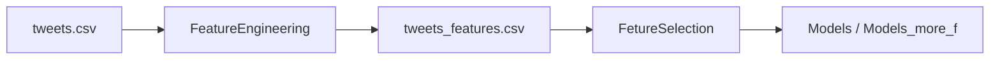

# Tweets Sentiment Predictor

Binary sentiment classification for Twitter posts: predict whether a tweet is **negative** or **positive**. The project was developed as coursework for a machine learning class and is implemented as a **Jupyter notebook pipeline** (feature engineering → feature selection → modeling).

## Overview

| Item | Description |
|------|-------------|
| **Task** | Binary classification (`0` = negative, `1` = positive) |
| **Data** | [Sentiment140](http://help.sentiment140.com/for-students/) (Twitter posts, 2009) |
| **Training set** | 100,000 tweets (50,000 per class, balanced) |
| **Evaluation** | 5-fold cross-validation, accuracy |
| **Best results** | ~**80.7%** accuracy (XGBoost / LightGBM with extended feature set) |

The workflow combines classical NLP signals (VADER, TextBlob), readability metrics, temporal and structural tweet features, and dense representations (Word2Vec, Sentence-BERT, Tiktoken-weighted embeddings).

## Project structure

```
TweetsSentimentPredictor/
├── data/                          # Not in git — see Setup (gitignored)
│   ├── tweets.csv                 # Raw Sentiment140-style export
│   └── tweets_features.csv        # Generated by FeatureEngineering.ipynb
├── FeatureEngineering.ipynb       # EDA, preprocessing, feature creation
├── FetureSelection.ipynb          # Correlation, univariate & L1 selection
├── Models.ipynb                   # Models on 14 selected features
├── Models_more_f.ipynb            # Models on ~45 selected features
├── requirements.txt
└── README.md
```

Run the notebooks **in order**. Each step reads the artifact produced by the previous one.

## Pipeline



### 1. `FeatureEngineering.ipynb`

- Loads `./data/tweets.csv` (`latin-1` encoding).
- Keeps 70% of shuffled data for training feature construction; holds out 30% as `test_set` (not used in the saved feature file for the main 100k sample).
- Balances classes: 50,000 negative (`Target == 0`) and 50,000 positive (original `Target == 4`, remapped to `1`).
- Builds a wide feature table and writes **`./data/tweets_features.csv`**.

**Feature groups:**

| Category | Examples |
|----------|----------|
| Lexical / structure | `Length`, `Mentions`, `has_mentions`, `has_exclamation_marks`, emoticons |
| Readability | Flesch reading ease (`FRE`), Gunning fog (`GFI`) via `textstat` |
| Lexicon sentiment | TextBlob polarity/subjectivity; VADER pos/neu/neg/compound |
| Temporal | `Weekday`, `Hour`, `skewed_hour_dist`, `skewed_week_dist`, `is_after_certain_day` |
| Text preprocessing | `ProcessedText` (URLs/mentions removed, lemmatization, custom stopwords) |
| Embeddings | 100-d Word2Vec (`w2v_0` … `w2v_99`); `all-MiniLM-L6-v2` sentence dims (`embedding_*`); Tiktoken-weighted vectors for top words |
| NLP (spaCy) | Named-entity counts per label |

> **Note:** `is_after_certain_day` is derived from a cutoff date in the training slice and can leak distribution-specific signal. It is dropped before modeling in the model notebooks but is documented in the engineering notebook as a deliberate trade-off for in-dataset evaluation.

TF-IDF features are computed in the notebook but **not** concatenated into the final export (`# df = pd.concat([df, tfidf_df], axis=1)` is commented out).

### 2. `FetureSelection.ipynb`

- Correlation heatmap vs. `Target` (threshold > 0.1).
- `feature_engine.selection.SelectBySingleFeaturePerformance` with a random forest estimator.
- `sklearn.feature_selection.SelectFromModel` with L1 logistic regression (`class_weight='balanced'`).
- PCA exploration on selected features.

Produces the feature lists used in the modeling notebooks (e.g. VADER, temporal skew features, selected `w2v_*` and `embedding_*` columns).

### 3. `Models.ipynb` vs `Models_more_f.ipynb`

Both load `./data/tweets_features.csv`, drop raw text/metadata columns, and use **`random_state=2115`** for reproducibility.

| Notebook | Features | Highlights |
|----------|----------|------------|
| `Models.ipynb` | **14** columns | Optuna hyperparameter search (logistic regression, random forest, gradient boosting); soft voting (~78.4% CV accuracy); stacking (~77.6%); Keras MLP; XGBoost with tuned params |
| `Models_more_f.ipynb` | **~45** columns | Same tooling plus **XGBoost** and **LightGBM** (~**80.7%** / ~**80.6%** 5-fold CV accuracy); deeper Keras training logs |

**Models evaluated (non-exhaustive):** logistic regression, random forest, gradient boosting, AdaBoost, bagging, voting, stacking, XGBoost, LightGBM, feed-forward neural network (TensorFlow/Keras).

## Results (5-fold CV accuracy)

Reported from executed notebook outputs; exact numbers may vary slightly if re-run.

| Model | `Models.ipynb` (14 feat.) | `Models_more_f.ipynb` (~45 feat.) |
|-------|----------------------------|-----------------------------------|
| Soft voting | 0.784 | — |
| Stacking | 0.776 | — |
| XGBoost | — | **0.807** |
| LightGBM | — | **0.806** |
| Keras MLP (validation) | ~0.78–0.80 | ~0.80 |

## Setup

### Requirements

- Python **3.10+** recommended (notebooks were run on 3.11).
- **8 GB+ RAM** advised for `FeatureEngineering.ipynb` (sentence embeddings on 100k tweets).
- Optional: **GPU** speeds up SentenceTransformer encoding; CPU works.

### Install dependencies

```bash
python -m venv .venv
source .venv/bin/activate   # Windows: .venv\Scripts\activate
pip install -r requirements.txt
```

### NLTK data

```bash
python -c "import nltk; nltk.download('punkt'); nltk.download('stopwords'); nltk.download('wordnet'); nltk.download('vader_lexicon')"
```

### spaCy model

```bash
python -m spacy download en_core_web_sm
```

### Dataset

1. Download the Sentiment140 training file (e.g. `training.1600000.processed.noemoticon.csv`) from the [Sentiment140 site](http://help.sentiment140.com/for-students/) or [Kaggle mirror](https://www.kaggle.com/datasets/kazanova/sentiment140).
2. Create a `data/` directory in the project root.
3. Place a CSV named **`tweets.csv`** with at least these columns (names must match the notebook):

   | Column | Description |
   |--------|-------------|
   | `Target` | `0` = negative, `4` = positive (remapped to `1` in code) |
   | `Date` | e.g. `Sat May 16 23:58:44 PDT 2009` |
   | `User` | Twitter username |
   | `Text` | Tweet text |

   Optional columns `ID` and `flag` are dropped if present.

The `data/` directory is **gitignored** (`Data/*` in `.gitignore`); you must obtain the data locally.

### Run

```bash
jupyter lab
# or: jupyter notebook
```

Open and run cells **top to bottom** in:

1. `FeatureEngineering.ipynb` → creates `data/tweets_features.csv` (large; may take tens of minutes).
2. `FetureSelection.ipynb` → informs which columns to keep.
3. `Models.ipynb` and/or `Models_more_f.ipynb`.

## Reproducibility

- Random seed **`2115`** is used for sampling, splits, and several estimators.
- Pinned versions are listed in `requirements.txt`.
- First-time runs download transformer weights (`all-MiniLM-L6-v2`) from Hugging Face.

## Tech stack

`pandas`, `numpy`, `scikit-learn`, `xgboost`, `lightgbm`, `tensorflow`/`keras`, `gensim`, `sentence-transformers`, `nltk`, `textblob`, `textstat`, `spacy`, `optuna`, `feature_engine`, `matplotlib`, `seaborn`, `shap` (listed in requirements; interpretability notebooks can be added separately).

## Limitations

- **Historical data** (2009 Twitter): language and style differ from modern tweets.
- **Binary only** — neutral tweets are not modeled.
- **Feature-heavy tabular model**, not an end-to-end transformer classifier on raw text.
- Class balance is **artificial** (50/50); real-world sentiment streams are usually imbalanced.
- Some features (e.g. date-based flags) do not generalize to new corpora without re-engineering.

## License

Academic / coursework project. Respect the [Sentiment140](http://help.sentiment140.com/for-students/) terms of use when downloading and sharing the dataset.
